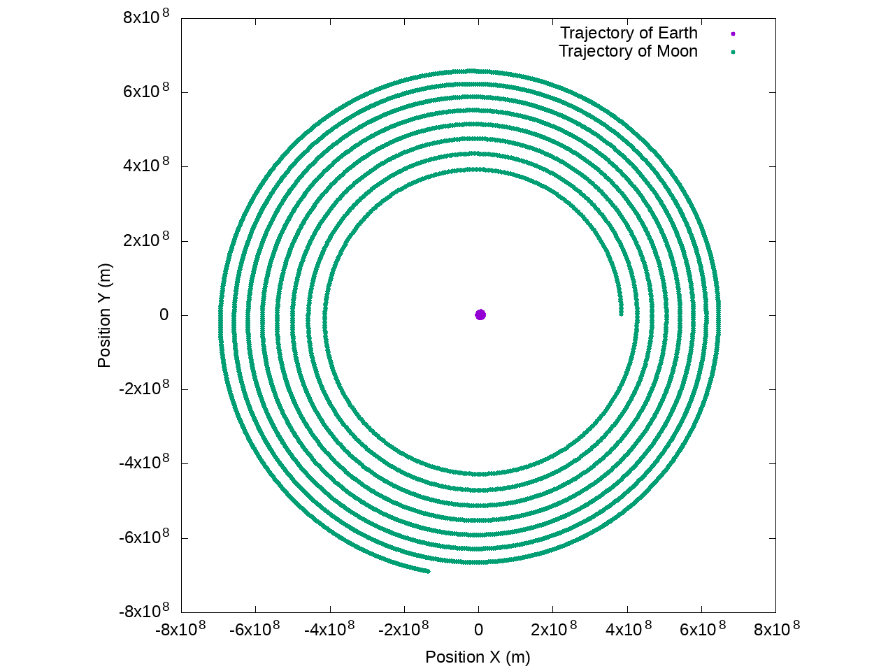
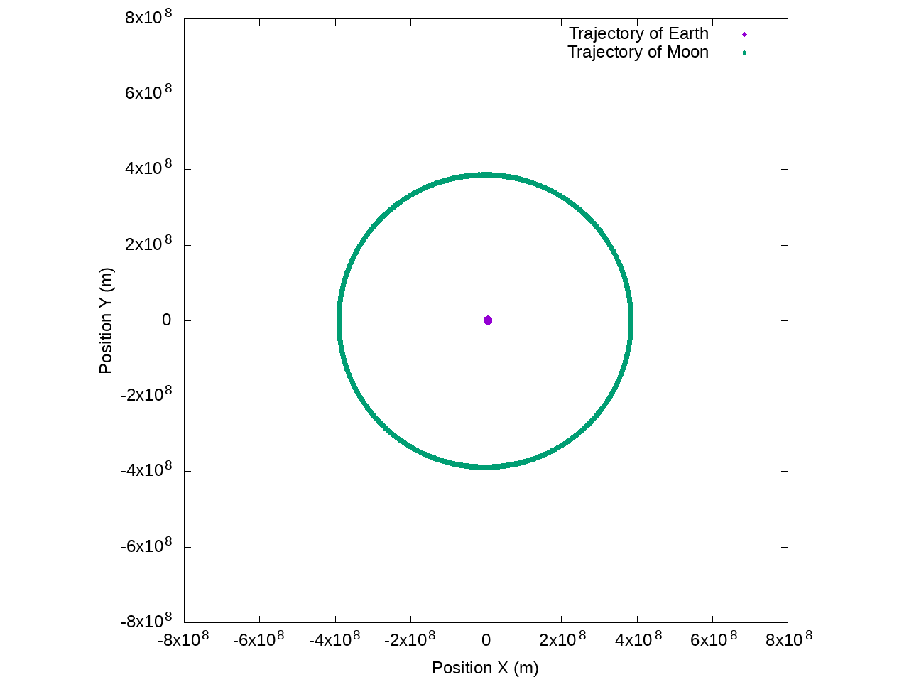
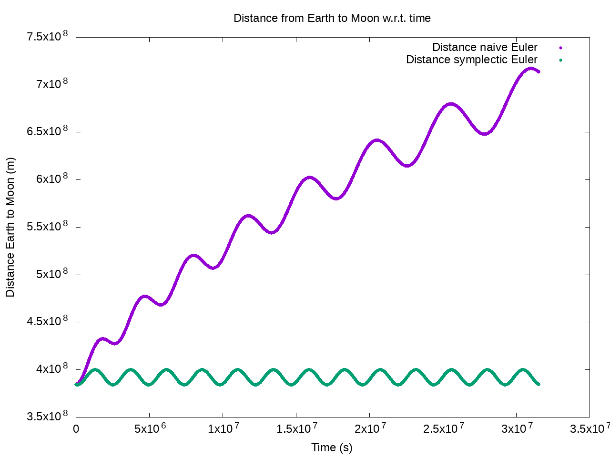

Integration with Euler method: naive vs symplectic
==================================================

Code for the article [Robust integration of equations of motion with Euler method](https://www.mgaillard.fr/2021/07/11/euler-integration.html) on my website.

## Build and run to generate images
```
$ git clone --recurse-submodules https://github.com/mgaillard/EulerIntegration.git
$ cd EulerIntegration
$ sh build.sh
$ sh run.sh
```

## Article as on my website

### Introduction

I had the chance to attend the graduate school of the [Symposium on Geometry Processing (SGP) 2021](https://sgp2021.github.io/) conference.
During the talk Projective Dynamics/Simulation, the author mentioned two different ways of integrating the equations of motion.
The naive Euler way that I was taught at school and the symplectic way that yields better results than the standard Euler method. 
The difference between the two methods is very subtle yet powerful! I love when small details like that have such massive impact, and I wanted to share that excitement.

Before describing the experiment that I conducted, I just wanted to give a bit more context.
When simulating physics, one must integrate the equations of motion as defined by Newton's second law. 
Different numerical integration methods exist: Euler, which is a first order method, or Runge–Kutta, which is a higher order method. 
Euler is by far the simplest method and was taught to me in High-school. However, we will see that it's not the best regarding precision over long-term integration. By slightly tweaking the Euler scheme, we obtain the symplectic Euler method. 
What's nice is that symplectic integrators preserve some properties of the exact solution and guarantees that integration does not diverge too much.
Of course, I explain that in my own words, which is not necessarily very precise with regards to mathematics. But feel free to look at these Wikipedia pages for my information:
 * [Wikipedia: Euler method](https://en.wikipedia.org/wiki/Euler_method)
 * [Wikipedia: Symplectic integrator](https://en.wikipedia.org/wiki/Symplectic_integrator)
 * [Wikipedia: Semi-implicit Euler method](https://en.wikipedia.org/wiki/Semi-implicit_Euler_method)

Effectively, the only thing that changes in the code is:
```c++
if (method == METHOD_NAIVE)
{
    new_position = objects[i].position + old_velocity * delta_time;
}
else if (method == METHOD_SYMPLECTIC)
{
    new_position = objects[i].position + new_velocity * delta_time;
}
```

### Experiments
To experimentally check whether symplectic Euler is better than vanilla Euler, I decided to simulate the orbit of the Moon around the Earth. I mainly want to see if there is a noticeable difference between the two methods, and what's the scale of the gain in precision if there is any. To setup the experiment I used this picture from [Wikipedia: Moon](https://en.wikipedia.org/wiki/Moon).


The initial conditions are that the Earth weighs 5.9722e24 kg and the Moon weights 7.342e22. The Moon is at an average distance of 384,405 km from the Earth and its orbital speed is about 1,022 m/s. Because the Moon has a non-negligeable weight, the Earth is also orbiting around the barycenter of the system (Earth + Moon) but I couldn't find the speed of Earth. So, I did it intuitively. I used Thales theorem to estimate it. The Earth is 4,641 km from the barycenter, therefore 4641/(384405-4641)*1022 = 12.5; I plotted the orbit of the Earth and found that it was not moving too much. I guess another way of solving this problem would be to minimize the total momentum of the two bodies. 

### Results

In this part, I show the trajectory of the Earth and the Moon as computed by the two different methods. To simplify the code, we stay in the 2D plane (Earth + Moon). To emphasize the difference in long-term precision between the two approaches, I voluntarily picked a coarse delta of time of one hour (3600 sec) and simulate the system for one year.

**Trajectory of the Earth and the Moon with the naive Euler implementation:**

We can see that the Moon is spiraling around the Earth, and as time goes, it is getting farther and farther from Earth. I didn't show it but at some point, it will go away from the gravitational potential of Earth, and be lost forever.

**Trajectory of the Earth and the Moon with the symplectic Euler implementation:**

We can see that the Moon is orbiting in a consistent circle around the Earth. Also, if we zoomed enough we would see that earth is also orbiting in a circle around the barycenter of the system (Earth + Moon).

Here I plot the distance from Earth to Moon with respect to time, for one entire year.
{: .img-responsive}
We can see that with the naive Euler approach the distance is increasing over time. Note that in both cases the distance is oscillating, it's because the trajectory of the Moon around the Earth is not a perfect circle but an ellipsoid. In this case (only two bodies), it should be a perfect circle. It's my fault, because I didn't find the exact perfect initial conditions for the system to orbit in circles. But, to my credit, in reality this is what is happening anyway. Interestingly, we can see that the moon is orbiting for a total of about 13 periods in one year. Which we can check by dividing 365 days by 29.5 days (moon revolution period) = 12.4 periods. 

### Conclusion
Symplectic Euler is indeed more robust than the simple Euler method. What I find the most satisfying is that it is very cheap to implement the better version while still getting a massive improvement in precision. In the future, I will never make the mistake of using the simple Euler anymore. Big thanks to the SGP graduate school!

### Code

**Github link:** [mgaillard/EulerIntegration](https://github.com/mgaillard/EulerIntegration)

```c++
#include <iostream>
#include <vector>

#include <glm/glm.hpp>
#include <glm/gtx/norm.hpp>

// Time step is one hour, it's voluntarily coarse 
const double delta_time = 3600.0;
// Simulation for one year
const int number_steps = 24*365;
const double gravity_constant = 6.674e-11;

using vec2 = glm::highp_dvec2;

struct Object
{
    std::string name;
    double mass;
    vec2 position;
    vec2 velocity;
    vec2 force;
};

const std::string METHOD_NAIVE = "naive";
const std::string METHOD_SYMPLECTIC = "symplectic";

int main(int argc, char *argv[])
{
    if (argc != 2)
    {
        std::cerr << "Give as argument to the program the integration method: naive or symplectic" << std::endl;
        return 1;
    }

    const std::string method = argv[1];

    if (method != METHOD_NAIVE && method != METHOD_SYMPLECTIC)
    {
        std::cerr << "The integration method can only be: naive or symplectic" << std::endl;
        return 1;
    }

    std::vector<Object> objects = {
        {"Earth", 5.9722e24, {0.0, 0.0}, {0.0, -12.5}},
        {"Moon", 7.342e22, {384405000.0, 0.0}, {0.0, 1022.0}},
    };
    
    for (int step = 0; step < number_steps; step++)
    {
        // Compute the gravity vector
        for (int i = 0; i < objects.size(); i++)
        {
            for (int j = i + 1; j < objects.size(); j++)
            {
                const auto vector = objects[j].position - objects[i].position;
                // Direction from i to j
                const auto direction = glm::normalize(vector);
                // Distance squared between i and j
                const auto distance_sq = glm::length2(vector);
                // Force
                const auto force = gravity_constant * (objects[i].mass * objects[j].mass) / distance_sq;
                
                objects[i].force = direction * force;
                objects[j].force = -objects[i].force;
            }
        }

        // Integration of the force for each object
        for (int i = 0; i < objects.size(); i++)
        {
            const auto acceleration = objects[i].force / objects[i].mass;
            
            const auto& old_velocity = objects[i].velocity;
            const auto new_velocity = old_velocity + acceleration * delta_time;

            // Integrate with different method
            vec2 new_position;
            if (method == METHOD_NAIVE)
            {
                new_position = objects[i].position + old_velocity * delta_time;
            }
            else if (method == METHOD_SYMPLECTIC)
            {
                new_position = objects[i].position + new_velocity * delta_time;
            }

            objects[i].velocity = new_velocity;
            objects[i].position = new_position;
        }

        // Show time, x, y for each object, distance earth-moon
        std::cout << step * delta_time << "\t"
                  << objects[0].position.x << "\t" << objects[0].position.y << "\t"
                  << objects[1].position.x << "\t" << objects[1].position.y << "\t"
                  << glm::distance(objects[0].position, objects[1].position) << std::endl;
    }

    return 0;
}
```
